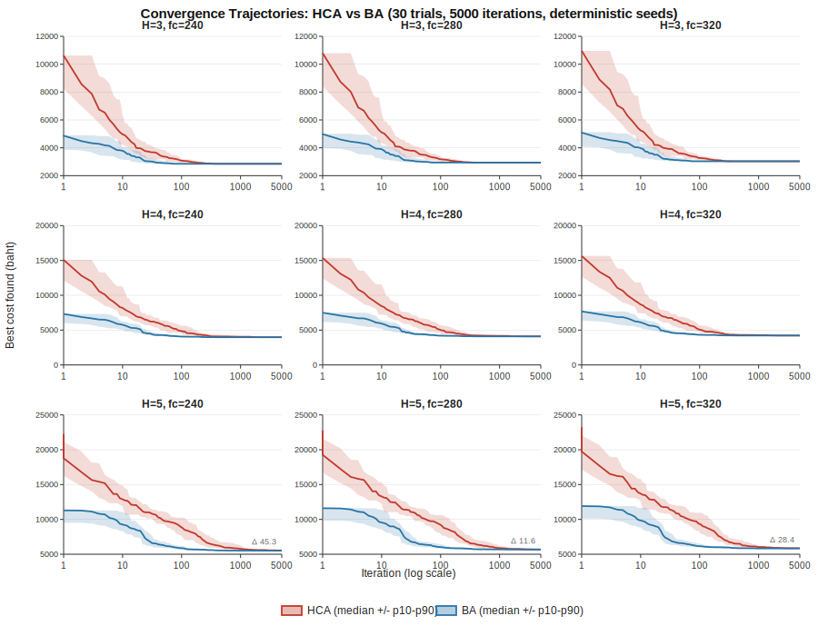

# Paper Figures -- rcopt Step 11

This document accompanies `algorithm_comparison.md` and provides the
primary figure for the research paper on modernising RC retaining wall
design software from Visual Basic 6.0 to a Node.js-based system.

## Figure 1 -- Convergence Trajectories: HCA vs BA

**Caption.** Convergence behaviour of the Hill-Climbing Algorithm (HCA,
red) and Bisection Algorithm (BA, blue) across the full 9-scenario
matrix of wall heights H in {3, 4, 5} m and concrete strengths
fc in {240, 280, 320} ksc. Each panel aggregates 30 independent trials
using deterministic seeds, with the same seed used for both algorithms
in each paired trial and a uniform iteration budget of 5000. Solid
lines are trial-wise medians of the running best-found cost; shaded
bands are the 10th-90th percentile envelopes across the 30 trials.
X-axis is iteration count on log scale; y-axis is best cost found in
baht. The H=5 row (bottom) carries the HCA-minus-BA final median gap
as a Delta annotation in baht, highlighting the paper's headline
result; see `algorithm_comparison.md` Section 6.

### Layout

The figure is a 3x3 grid. Rows correspond to wall height H (3, 4, 5 m,
top to bottom); columns correspond to concrete strength fc
(240, 280, 320 ksc, left to right). Within each row, all three panels
share identical y-axis bounds and tick positions to enable direct
horizontal comparison at constant difficulty:

- H=3 row: y in [2000, 12000] baht, ticks every 2000
- H=4 row: y in [0, 20000] baht, ticks every 5000
- H=5 row: y in [5000, 25000] baht, ticks every 5000

All nine panels share the same x-axis (1 to 5000 iterations, log
scale; ticks at 1, 10, 100, 1000, 5000). A single shared legend at
the bottom of the figure identifies the HCA (red) and BA (blue)
series.

### Key observations

1. **H=3 row -- both algorithms converge to the same optimum.**
   The HCA and BA medians coincide at the final iteration across all
   three fc values, and both algorithms reach the global optimum in
   30/30 trials. The visible difference between the curves is purely
   a convergence-speed difference:    BA reaches the plateau in
   approximately 85 iterations while HCA requires roughly 350-380.
   The Delta annotation is omitted because the final gap is zero.
   Cross-reference: `algorithm_comparison.md` Section 4 (Wilcoxon
   speedup 76-78%).

2. **H=4 row -- the reliability gap opens.** HCA begins missing the
   optimum on some trials (23-25 of 30 hits across the three fc
   values) while BA maintains 30/30 hits. The final-median cost gap
   is small (approximately 3-5 baht) and visible as a thin separation at the right
   edge of each H=4 panel. Cross-reference: `algorithm_comparison.md`
   Section 4 (McNemar discordant splits b=0, c=5-7).

3. **H=5 row -- BA dominance is visually pronounced.** BA's median
   curve settles substantially below HCA's, and the Delta annotations
   (45.3, 11.6, 28.4 baht from left to right) are directly readable
   from the figure. The leftmost panel (H=5, fc=240) is the paper's
   centrepiece: HCA hits the optimum in 0 of 30 trials at the
   5000-iteration budget, BA in 9 of 30, and the paired 95%
   confidence interval on cost advantage is [28.21, 68.68] baht.
   Cross-reference: `algorithm_comparison.md` Section 6.

4. **Difficulty-scaling effect.** Reading the figure top-to-bottom,
   the BA advantage progresses from pure-speed (H=3) through
   speed-plus-reliability (H=4) to speed-plus-reliability-plus-final-
   cost (H=5). This pattern supports the paper's central claim that
   BA's advantage scales with problem difficulty rather than being a
   flat algorithmic constant. Cross-reference: `algorithm_comparison.md`
   Section 5 (stratified per-H analysis).

## Reproducibility

All artefacts regenerate deterministically from source. Commands
below assume working directory `backend/`.

1. Generate raw trajectories (output `out/step_11/trajectories.json`,
   approximately 40 MB, gitignored):

       node scripts/run_trajectories.js

2. Sample and summarise for plotting (output
   `out/step_11/figure_data.json`, 192 KB, committed):

       node scripts/prepare_figure_data.js

3. Render the SVG (output
   `out/step_11/figures/convergence_grid.svg`, 91.8 KB, committed):

       node scripts/generate_convergence_figure.js

The pipeline is fully deterministic: seeds 1..30 per scenario, paired
assignment between HCA and BA, no wall-clock or PID inputs to any
random source. The full test suite (668 tests across 7 modules) must
pass before the trajectory run.

### Sampling and aggregation choices

- **Log-spaced sampling.** Raw trajectories record the best cost at
  every one of 5000 iterations (5000 iterations x 30 trials x 9
  scenarios = 1.35M data points). For plotting, this is downsampled
  to 83 log-spaced sample points per trajectory, which preserves
  visual fidelity on a log x-axis while reducing file size by
  roughly 60x.

- **p10 / p50 / p90 envelope.** Each sample point's distribution
  over 30 trials is summarised as 10th, 50th, and 90th percentiles.
  The median is plotted as a line; the p10-p90 band captures the
  bulk of trial-to-trial variation without being distorted by
  outliers. This choice is robust to the non-normal convergence
  distributions typical of stochastic optimisation.

## Data availability

- `backend/out/step_11/figure_data.json` -- sampled trajectory
  summaries used directly by the figure renderer (committed).
- `backend/out/step_11/trajectories.json` -- full raw trajectories
  (gitignored due to size; regenerable via the command above).
- `backend/out/comparison/comparison_results.json` -- paired-trial
  records underlying `algorithm_comparison.md` (committed).

## Related documents

- `algorithm_comparison.md` -- Step 10.3 head-to-head comparison
  with paired Wilcoxon, McNemar, and cost-delta tests; provides
  the statistical backing for the visual claims in this figure.
- `step_9_5_validation.md` -- HCA port validation against VB6
  reference.
- `step_10_ba_validation.md` -- BA port validation against VB6
  reference.

---

*Generated for Step 11 Wave 4. Figure 1 and this document together
constitute the primary visual deliverable for the research paper on
modernising RC retaining wall design from VB6 to a Node.js web-based
system with AI integration.*
